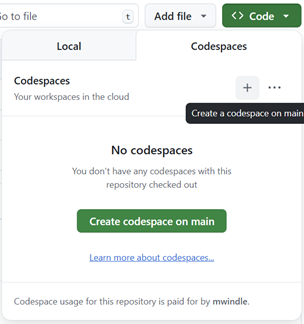

# vibe-agent
Think vibe coding apps are magic? Well, they kind of are, but they are also pretty simple at their core. Follow this guide to build your own vibe coding agent like Lovable, v0, Replit, etc. Some assembly required. 

This base project includes a working agent that can interact with Anthropic's message API and two tools to get you started - ReadFile and WriteFile. With those tools and a couple of prompts, you can use the agent to build more tools and eventually start building your own apps. 

The instructions below will walk you through: 

1. Getting the base agent running (it's a command line app written in TypeScript)
1. Use the agent with the provided tooling prompts to build more tools -- go ahead and try adding more!
1. Use the agent to build your own app

Before you get started, make sure you have setup your Anthropic API key. You can do this by following the instructions [here](https://docs.anthropic.com/en/api/getting-started).

## Running the base agent
There are a couple of ways to run this project -- do whatever works best for you. 

*Either way, you should start by forking this project*
### Option 1 (recommended): Run the agent in a GitHub Codespace
1. Create a new Codespace from this project



2. Add your Anthropic API key to a `.env` file in the project root (look at `.env.template` for an example)
```text
ANTHROPIC_API_KEY = "..."
```

3. Run the agent
```bash
npm run start
```

### Option 2: Run the agent locally
1. Clone this project

2. Add your Anthropic API key to a `.env` file in the project root (look at `.env.template` for an example)
```text
ANTHROPIC_API_KEY = "..."
```

3. Install dependencies
```bash
npm install
```

4. Run the agent
```bash
npm run start
```

## Use the base agent to add more tools
Now for the fun part -- have the agent build itself into a real vibe-coding agent!

### Agent generated tools
```text
[You]: Follow the instructions in ./prompts/user/create-list-files-tool.md
....

[You]: Follow the instructions in ./prompts/user/create-file-exists-tool.md
...

[You]: Follow the instructions in ./prompts/user/create-folder-tool
...

[You]: Follow the instructions in ./prompts/user/create-file-exists-tool.md
...

[You]: Follow the instructions in ./prompts/user/create-npm-tool.md
...

```

### Try out the new tools
Close and re-run the agent.
```bash
#Ctrl+C
npm run start
```

Go ahead and ask it to list and create files and folders!
```text
[You]: Tell me what ./src/agent.ts does
...

```
*Note that your results will vary, and you may encounter errors. You are now at a point where you can ask the agent to help you fix any errors you encounter -- just past the error message in and ask it to "think step by step to fix it". 

## Build your own app
Now that you've got a working agent, you can use it to build your own app.

### Change the agent's system prompt
Update the system prompt path in `./src/index.ts` to point to the `project` system prompt.
```typescript
const systemPrompt = fs.readFileSync("./prompts/system/project.md", "utf-8");
```

Close and re-run the agent again

### Build your app
Now you can build whatever app you want! Try out the three-part prompts in the ./prompts/examples folder.


